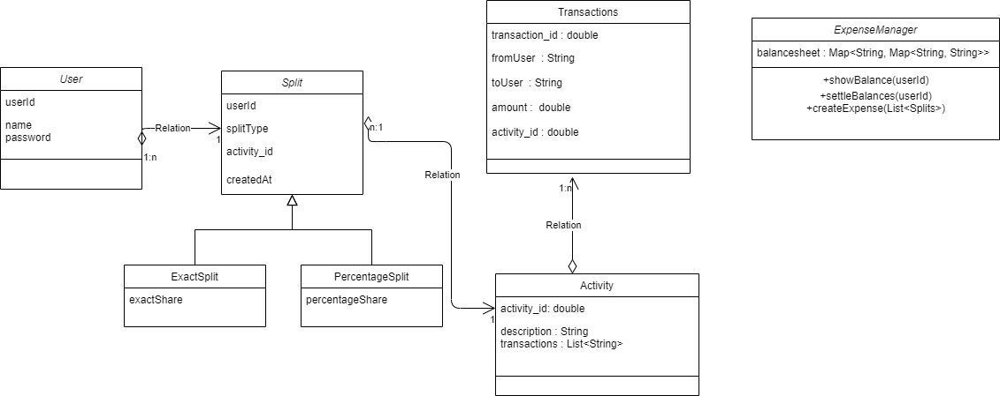
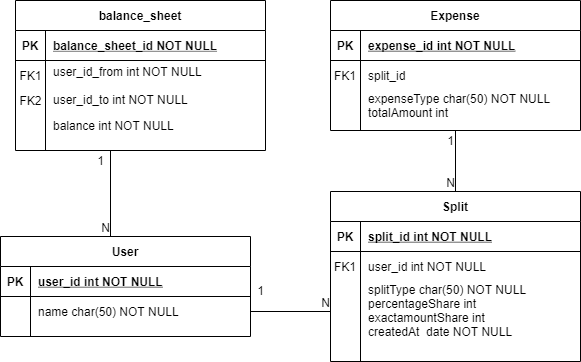

# Splitwise Application

## How to run this application
 git clone https://github.com/deep-kiran/splitwise.git  
install maven dependencies

Access the apis via localhost:8080/api/v1

## Class diagram 

## Database diagram
 
